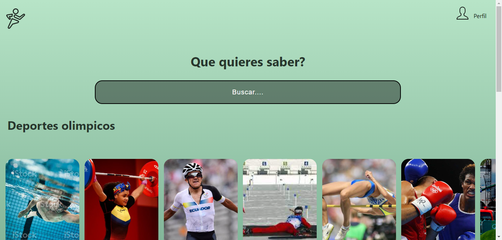

# Página de Deportes

Este repositorio contiene el código fuente de una página web diseñada para presentar información detallada sobre diversos tipos de deportes. La página se ha estructurado en diferentes secciones que incluyen deportes olímpicos, deportes de equipo y deportes de contacto. Cada sección cuenta con un carrusel interactivo que muestra imágenes y detalles relevantes sobre los deportes correspondientes.



---

## Características Principales

- Diseño responsivo para una experiencia óptima en dispositivos móviles y de escritorio.
- Carruseles interactivos que permiten a los usuarios explorar contenido multimedia y obtener información detallada sobre cada deporte.
- Navegación intuitiva y accesible para una fácil exploración de las diferentes secciones.
- Estilos cuidadosamente diseñados para proporcionar una apariencia atractiva y profesional.

---

## Tecnologías Utilizadas

- HTML5
- CSS3

---
## Instrucciones de Uso

1. Clona este repositorio en tu sistema local utilizando el siguiente comando:

   ```bash
   git clone https://github.com/tuusuario/nombre-del-repo.git
    ```
2. Abre el archivo `index.html` en tu navegador web para visualizar la página.

---


